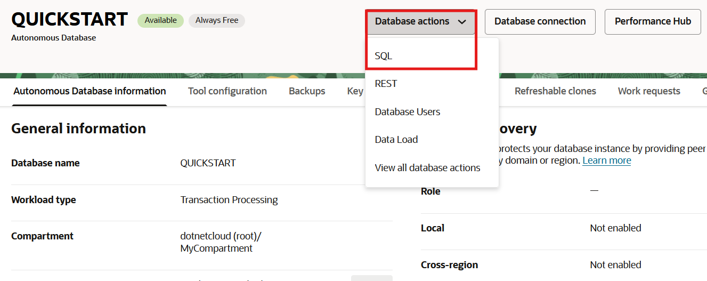
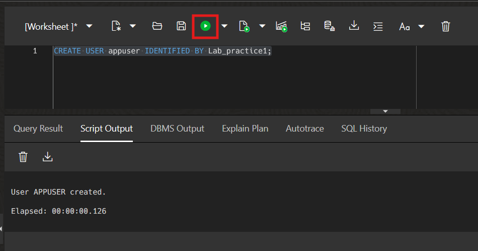
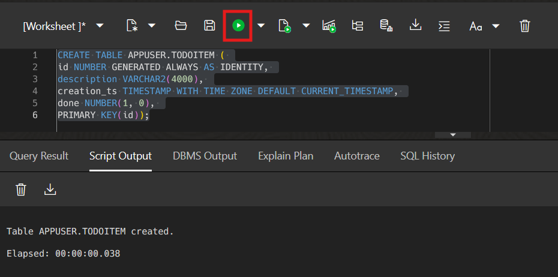
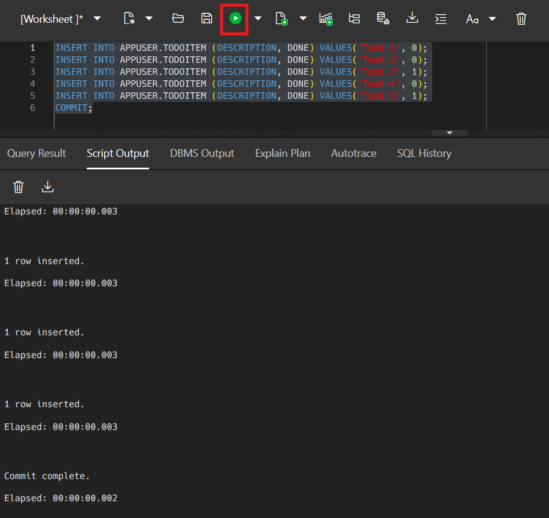

# Create user and setup schema

## Introduction

In this lab, you will connect to the database using SQL Worksheet, a browser-based tool that is easily accessible from the Autonomous Database console. You will then create a database user (schema), assign privileges to the user, and enable the user to log in to the database. You will create a table, add records, and query the table to view the results in that user account.

Estimated lab time: 10 minutes

### Objectives
-   Connect to your new autonomous database using SQL Worksheet
-   As administrator, create a database user (schema)
-   Assign privileges to the user
-   Enable a database user to log in to the database using SQL Worksheet
-   Create a table and add records

### Prerequisites

-   This lab requires a provisioned Oracle Autonomous Database.

## Task 1: Connect with SQL Worksheet

Although you can connect to your autonomous database from local desktop tools, such as Visual Studio, you can conveniently access the browser-based SQL Worksheet directly from your Autonomous Database console.

1. In your database's details page, click the **Database Actions** button. Then choose the **SQL** option.

    

If a sign-in page opens for Database Actions, simply use your database instance's default administrator account, **Username - ADMIN**, and **Password** you specified when creating the database, then click **Sign in**.

2. The Database Actions page opens with a SQL Worksheet window.

    

   You can close the **Run Statement** popup by clicking the **X** in the upper right hand corner. Please **proceed to the next task.**

## Task 2: Create a User
Database administrators perform many tasks. One of their more common tasks is creating database users and assigning them unique usernames. After users log in to the database with their username and password, they can issue database SQL statements to create objects, query objects, and manage the database.

Creating a user is a way to create a schema. In this section, you execute the `CREATE USER` statement to create and configure a database user.

**Syntax**: `CREATE USER <user> IDENTIFIED BY <password>;`

**Note**:  The password specified must meet the default Oracle database password complexity rules:

  - The password must be between 12 and 30 characters long and must include at least one uppercase letter, one lowercase letter, and one numeric character.
  - Note, the password limit is shown as 60 characters in some help tooltip popups. Limit passwords to a maximum of 30 characters.
  - The password cannot contain the username.
  - The password cannot be one of the last four passwords used for the same username.
  - The password cannot contain the double quote (") character.
  - The password must not be the same password that is set less than 24 hours ago.

1. In this lab's previous task, you connected to SQL Worksheet as the autonomous database administrator. When connected as administrator, open a SQL Worksheet and create a user named `APPUSER` by copying and pasting the following command to the worksheet. Click on the green and white Run Statement button to execute the command.

    ```
    <copy>CREATE USER appuser IDENTIFIED BY Lab_practice1;</copy>
    ```

  

## Task 3: Assign Privileges
When multiple users access database objects, such as tables, you can control the privileges to the objects. Privileges control whether a user can modify an object that is owned by another user. They are granted or revoked either by:
- The instance administrator
- A user with ADMIN privileges
- The object's owner  

In general, there are two types of privileges:
- System privilege: The right to perform a particular action on any object, such as, tables, views and indexes. Only the instance administrator or a user with the ADMIN privilege can assign or revoke system privileges.
- Object privilege: The right to perform a particular action on an object or to access another user's object. An object's owner has all object privileges for that object and can assign object privileges for that object to other database users.

Here are a few of the basic system and object privileges:

**System privileges:**
- Create a table, a view, or an index that is owned by any user in the database
- Alter a table, a view, or an index in the database
- Drop a table, a view, or an index in the database

**Object privileges:**
- Insert values into a table
- Create a foreign key dependency for a table
- Select from a table
- Update a table

You use the `GRANT` statement to assign privileges to users and roles. To assign privileges, you must have been assigned either the `ADMIN OPTION` or the `GRANT ANY PRIVILEGE` system privilege.

Syntax: `GRANT <privilege> TO <user>;`

1. When you create a user with the `CREATE USER` statement, the user's privilege domain is empty by default. The administrator assigns privileges to the user based on the tasks that the user may perform in the future. In this lab, the APPUSER user establishes a session, creates a table, and writes DML statements against tables. Execute the following statement to assign the required privileges to the APPUSER user:

    ```
    <copy>GRANT CREATE SESSION, CREATE TABLE, UNLIMITED TABLESPACE TO appuser;
    </copy>
    ```

  


## Task 4: Create a Table and Add Records
1. You are still connected to SQL Worksheet as administrator. In this section, you execute the `CREATE TABLE` statement to create a table to track to do items in the APPUSER schema.

      **Syntax**: 
	```
	CREATE TABLE [schema.]table (column datatype [DEFAULT expr][, ...]);
	```

      Perform the following steps to create the `TODOITEMS` table in the APPUSER schema. Since the ADMIN user will be creating these, we will prepend APPUSER to the table name.

3. Create the `TODOITEM` table with the `ID` column as the primary key.

    ```
    <copy>CREATE TABLE APPUSER.TODOITEM ( 
	id NUMBER GENERATED ALWAYS AS IDENTITY, 
	description VARCHAR2(4000), 
	creation_ts TIMESTAMP WITH TIME ZONE DEFAULT CURRENT_TIMESTAMP, 
	done NUMBER(1, 0), 
	PRIMARY KEY(id));
      </copy>
      ```

  

4. You will now populate the table with sample data. You will add rows by executing `INSERT` statements.

    **Syntax**: 
	```
	INSERT INTO [schema.]table [(column [, column...])] VALUES (value [, value...]);
	```

    Execute the following statements to insert data into the `TODOITEM` table. We will again prepend APPUSER to the table name. When executing more than one statement in the worksheet at a time, highlight all the SQL to execute with the mouse, then click the green and white Run Statement button.

    ```
    <copy>INSERT INTO APPUSER.TODOITEM (DESCRIPTION, DONE) VALUES('Task 1', 0);
INSERT INTO APPUSER.TODOITEM (DESCRIPTION, DONE) VALUES('Task 2', 0);
INSERT INTO APPUSER.TODOITEM (DESCRIPTION, DONE) VALUES('Task 3', 1);
INSERT INTO APPUSER.TODOITEM (DESCRIPTION, DONE) VALUES('Task 4', 0);
INSERT INTO APPUSER.TODOITEM (DESCRIPTION, DONE) VALUES('Task 5', 1);
COMMIT;

    </copy>
    ```
  

5. You can retrieve the data from the `TODOITEM` table. Execute the following statement to select all the `DESCRIPTION` and `DONE` columns and view the results:

    ```
    <copy>SELECT DESCRIPTION, DONE FROM APPUSER.TODOITEM;</copy>
    ```
  
  You may now **proceed to the next lab.**

## Want to Learn More?

Click [here](https://docs.oracle.com/en/database/oracle/oracle-database/23/cncpt/introduction-to-oracle-database.html) for documentation introducing Oracle database fundamentals.

## Acknowledgements

- **Author** - Rick Green, Alex Keh
- **Last Updated By/Date** - Alex Keh, August 2025