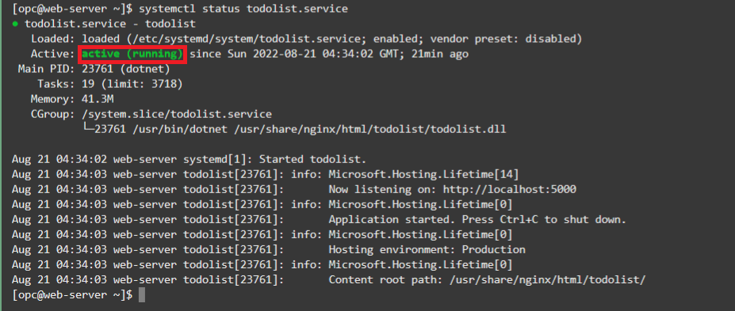
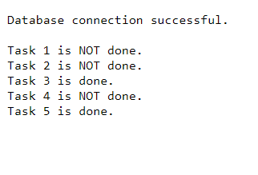

# Develop and deploy the .NET web application

## Introduction

In this lab, you will create a simple ASP.NET Core app, connnect to Oracle Autonomous Database using Oracle Data Provider for .NET (ODP.NET), and retrieve data to the web page on the OCI VM you previously set up. You will then publish the web app so that it can be accessed from a browser.

Note: This lab has been validated with ASP.NET Core 6. Some variations in the ASP.NET Core code may be necessary if you are using another version.

Estimated lab time: 15 minutes

### Objectives
-   Create a new ASP.NET Core web app
-   Develop and deploy ODP.NET Core app that connects to your Oracle Autonomous Database
-   Configure NGINX web server and service to run the ASP.NET Core app
-   Access the web app from a browser

### Prerequisites

-   This lab requires completing all the previous labs in this workshop.

## Task 1: Create ASP.NET Core Web App

We will connect to Cloud Shell again to begin developing the ASP.NET Core part of the To Do List application. The project will incorporate ODP.NET Core for data access between the app and Oracle Autonomous Database.

1. Open Cloud Shell by clicking the Developer Tools icon on the top right of the menu bar, then click **Cloud Shell**.

    

2. If you have been logged out of the last SSH session, SSH into the web server machine once again:

    ```
    <copy>ssh -i <key_directory_path><private_ssh_key> opc@<public_ip_address></copy>
    ```
Provide the key directory path (i.e. .ssh/), if applicable, the private key name, and machine public IP as in Lab 4.

3. We will use the .NET Command Line Interface (CLI) included with the Oracle Cloud Developer image. Execute the following command to create a new ASP.NET Core web app project in a new directory, "todolist":

    ```
    <copy>dotnet new web -o todolist</copy>
    ```

  This command creates an ASP.NET Core empty web project. 

4. Change directory into the "todolist" directory. Then, add the ODP.NET Core assembly to the project from NuGet Gallery.

    ```
    <copy>cd todolist</copy>
    ```

    ```
    <copy>dotnet add package Oracle.ManagedDataAccess.Core</copy>
    ```

## Task 2: Develop and Deploy an ODP.NET Core App that Connects to Your Oracle Autonomous Database
We will create a simple web application that returns the current tasks (DESCRIPTION column) and their completion status (DONE column) from the TODOITEM table when the end user accesses the website's *todo* subdirectory. If the end user accesses the website root directory, they will be greeted with a "Hello World" message. 

1. Copy and paste the following .NET sample code to a local text file to modify:

    ```
    <copy>using Oracle.ManagedDataAccess.Client;
    
    var builder = WebApplication.CreateBuilder(args);
    var app = builder.Build();
    
    app.MapGet("/", () => "Hello World!");
    
    app.MapGet("/todo", async (context) =>
    {
      //Set the user id, password and data source
      //Set Data Source value to Oracle connect descriptor or net service name
      string conString = "User Id=appuser;Password=<PASSWORD>;Data Source=<DESCRIPTOR>;";          
      using (OracleConnection con = new OracleConnection(conString))
      {
        using (OracleCommand cmd = con.CreateCommand())
        {
          try
          {
            con.Open();
            await context.Response.WriteAsync("Database connection successful.\n\n");
            //Retrieve TODOITEM table with completion status of each task
            cmd.CommandText = "SELECT description, done FROM todoitem";
            OracleDataReader reader = cmd.ExecuteReader();
            while (reader.Read())
            {
              if (reader.GetBoolean(1))
                await context.Response.WriteAsync(reader.GetString(0) + " is done.\n");
              else
                await context.Response.WriteAsync(reader.GetString(0) + " is NOT done.\n");
            }
            reader.Dispose();
          }
          catch (Exception ex)
          {
            await context.Response.WriteAsync(ex.Message);
          }
        }
      }
    });

    app.Run();
    </copy>
    ```

2. Modify the ASP.NET Core app to connect to your Oracle Autonomous Database instance.

     The **User Id** value in the sample code is set to APPUSER. Change this value if the your database user has another name. 

     Add the **Password** and **Data Source** entries. In the previous lab, you retrieved the connect descriptor after configuring one-way TLS for Oracle Autonomous Database.

     Save the file and copy the entire file text.

3. Return to Cloud Shell to modify the .NET app's **Program.cs** file with your modified code. First, delete the default file contents.

    ```
    <copy>echo "" > Program.cs
    </copy>
    ```

4. Open the **Program.cs** with the Nano editor from the command line.

    ```
    <copy>nano Program.cs
    </copy>
    ```

5. Paste the code to this file by typing ***Ctrl-V*** in the Nano editor.

6. Save and close the file by typing ***Ctrl-X***, then ***Y***, then a carriage return in the Nano editor. The app is now ready to run. Let's build and deploy the app to the web server.

7. In Cloud Shell, create a *todolist* sub-directory in the NGINX default web root directory */usr/share/nginx/html*. This is the location where we will deploy the web app.

    ```
    <copy>sudo mkdir /usr/share/nginx/html/todolist
    </copy>
    ```

8. Build and publish the web app to NGINX by running the following command:

    ```
    <copy>sudo dotnet publish --configuration Release -o /usr/share/nginx/html/todolist
    </copy>
    ```
You have completed deploying the ASP.NET Core web app. 

## Task 3: Configure NGINX Web Server and Service to Run the ASP.NET Core App

1. Configure the NGINX web server so that it can run ASP.NET Core apps from Oracle Linux.

    - Configure NGINX to enable HTTP to initiate a connection to the network.

        ```
        <copy>sudo setsebool -P httpd_can_network_connect 1</copy>
        ```

    - Edit the NGINX configuration file in a text editor, such as Nano, to add the proxied server.

        ```
        <copy>sudo nano /etc/nginx/nginx.conf</copy>
        ```

      After the text editor opens, find the *location* context area. Between the braces, add the protocol, address, and port of the proxied server.

        ```
        <copy>proxy_pass         http://127.0.0.1:5000;
        </copy>
        ```
        
        The *location* context area should now look like the following:
        
        ```
        location / {
            proxy_pass         http://127.0.0.1:5000;
        }
        ```

      Exit Nano and save the file by typing **Ctrl-X**, then **Y**, and finally the carriage return.

2. Requests made to *http://&lt;serveraddress&gt;:81* are now forwarded to the ASP.NET Core app running at *http://127.0.0.1:5000* on Kestrel. But NGINX isn't set up to manage the Kestrel process. We will create a service definition file to run the web app on the server.

    - From Cloud Shell, create a new service definition file for your web app and begin editing it.

        ```
        <copy>sudo nano /etc/systemd/system/todolist.service</copy>
        ```

    - Copy the contents below into the service configuration file.

        ```
        <copy>
        [Unit]
        Description=todolist
        
        [Service]
        WorkingDirectory=/usr/share/nginx/html/todolist
        ExecStart=/usr/bin/dotnet /usr/share/nginx/html/todolist/todolist.dll
        Restart=always
        # Restart service after 10 seconds if the dotnet service crashes:
        RestartSec=10
        KillSignal=SIGINT
        SyslogIdentifier=todolist
        User=nginx
        Environment=ASPNETCORE_ENVIRONMENT=Production
        Environment=DOTNET_PRINT_TELEMETRY_MESSAGE=false
        
        [Install]
        WantedBy=multi-user.target
        </copy>
        ```

      Exit Nano and save the file by typing **Ctrl-X**, then **Y**, and finally the carriage return.

3. Restart NGINX to load the new proxy settings.

    - Restart NGINX with the new settings from Cloud Shell.

        ```
        <copy>sudo systemctl restart nginx</copy>
        ```

    - Verify NGINX is "<span style="color:green">active (running)</span>" and there are no outstanding issues.

        ```
        <copy>sudo systemctl status nginx</copy>
        ```
      The results should look similar to the following:
    
    

4. Enable and start the service hosting the ASP.NET Core web app.

    - From Cloud Shell, enable the application service.

        ```
        <copy>sudo systemctl enable todolist.service</copy>
        ```

    - Next, start the application service.

        ```
        <copy>sudo systemctl restart todolist.service</copy>
        ```

    - Verify the service status is "<span style="color:green">active (running)</span>" and there are no outstanding issues.

        ```
        <copy>systemctl status todolist.service</copy>
        ```
      The results should look similar to the following:
    
    

The web app should now be accessible from the internet.

## Task 4: Access the Web App

1. Let's test that the web app is accessible from the internet. Navigate to *http://&lt;public_ip_address&gt;:81/todo* (the IP address of the Linux VM) in a web browser outside of the virtual machine. You should see a message saying you are connected to Oracle Autonomous Database and the task status in the To Do list.

    

Congratulations! You have completed this workshop.

The next lab cleans up the resources you created during the workshop. You may now **proceed to the next lab.**

## Want to Learn More?

Click [here](https://www.oracle.com/database/technologies/appdev/dotnet.html) to learn more about developing .NET applications with Oracle database and Oracle Cloud.

## Acknowledgements

- **Author** - Alex Keh
- **Last Updated By/Date** - Alex Keh, June 2023