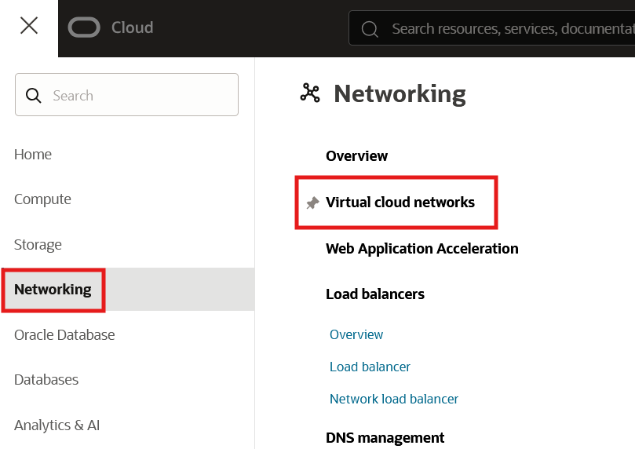
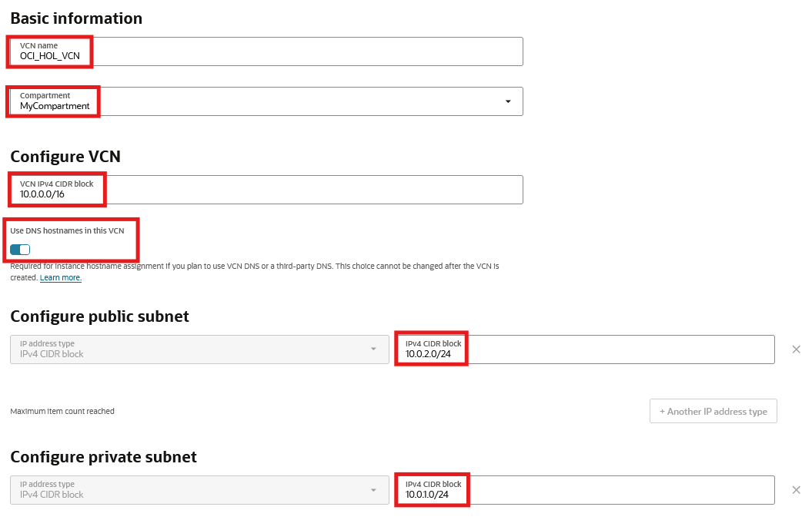
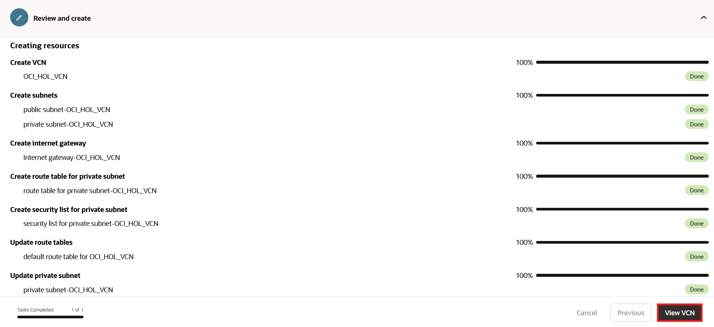

# Create a Virtual Cloud Network

## Introduction

Oracle Cloud Infrastructure (OCI) Compute lets you create multiple Virtual Cloud Networks (VCNs). These VCNs will contain security lists, compute instances, load balancers and many other types of network assets. 

In this lab, we will create a VCN that will be used to connect the OCI Compute web server with Oracle Autonomous Database.

You may review [Overview of Networking](https://docs.cloud.oracle.com/iaas/Content/Network/Concepts/overview.htm) to gain a full understanding of the network components and their relationships, or take a look at this video:

Estimated lab time: 5 minutes

Here is an instructional video, going through the process of making a VCN:

### Objectives
In this lab, you will:
- Create a virtual cloud network

### Prerequisites

* An Oracle Cloud Account

## Task 1: Create Your VCN

If you are running this workshop in a LiveLabs environment, understand that it uses a pre-configured Virtual Cloud Network (VCN). As such, you will not create a VCN in this workshop. However, you can observe how a VCN is created in Oracle Cloud Infrastructure by watching this short video:

 

If running this workshop from other environments, create a VCN on Oracle Cloud Infrastructure:

1. On the Oracle Cloud Infrastructure Console home page, under the **Get started** tab, scroll down to the **Launch Resources** header, click **Set up a network with a wizard**.

    

2. Select **Create VCN with Internet Connectivity**, and then click **Start VCN Wizard**.

    

3. Complete the following fields. Modify the default settings if they don't match the below values.

    |                  **Field**              |    **Value**  |
    |----------------------------------------|:------------:|
    |VCN name |OCI\_HOL\_VCN|
    |Compartment |  Choose the same compartment as the Oracle Autonomous Database (i.e. MyCompartment)
    |VCN IPv4 CIDR Block|10.0.0.0/16|
    |Use DNS hostnames In This VCN| Checked|
    |Public subnet IPv4 CIDR block|10.0.2.0/24|
    |Private subnet IPv4 CIDR block|10.0.1.0/24|

    Your screen should look similar to the following:

    

     Click the **Next** button at the bottom of the screen.

4. Review your settings to be sure they are correct. Click the **Create** button to create the VCN. 
    

5. It will take a moment to create the VCN and a progress screen will keep you apprised of the workflow.

    

6. Once you see that the creation is complete (see previous screenshot), click the **View VCN** button.

### Summary

This VCN will contain all of the other assets that you will create during this set of labs. In real-world situations, you would create multiple VCNs based on their need for access (which ports to open) and who can access them. Both of these concepts are covered in the next lab. 

You may now **proceed to the next lab.**

## Acknowledgements

- **Author** - Rajeshwari Rai, Prasenjit Sarkar, Alex Keh 
- **Last Updated By/Date** - Alex Keh, June 2023