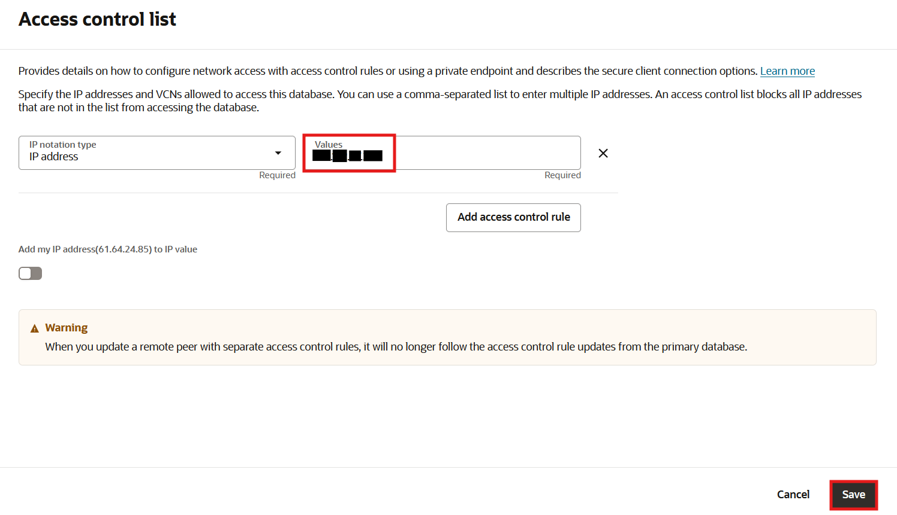

# Enable one-way TLS without wallets

## Introduction

Oracle Autonomous Database on Shared Exadata Infrastructure secures connections by using the Transport Layer Security (TLS) protocol. TLS encrypts ODP.NET and database communication and enables both sides to authenticate each other. With Oracle Autonomous Database TLS, there are are two options available:
- mutual TLS (mTLS)
- one-way TLS

mTLS connections enable the database client and server to authenticate each other. It is used by Oracle Autonomous Database by default and requires wallets.

One-way TLS feature just the client authenticating against the database server. The key differences are that it does not require wallets and its connection latency is better compared to mTLS. One-way TLS connections remain secure since they can only be used only with
- Private endpoints
- Public endpoints with an Access Control List (ACL) that has at least one IP or VCN rule

In this lab, you will enable one-way TLS without wallets to simplify web application set up easier with Oracle Autonomous Database. You will add the web server's IP to the ACL. You will also record the database's connect descriptor. With just the connect descriptor information, you will be able to connect to the database without having to deploy wallet, sqlnet.ora, nor tnsnames.ora files in the next lab when you deploy a web application.

Estimated Time: 5 minutes

### Objectives
In this lab, you will:
- Add the web server's IP address to the database's ACL
- Enable one-way TLS for your Oracle Autonomous Database isntance
- Retrieve the database's connect descriptor

### Prerequisites

* Complete the preceding labs that create the Oracle Autonomous Database instance and configure the web server.

## Task 1: Add the Web Server to the ACL and Enable One-Way TLS

Connect to the Oracle Autonomous Database instance you created in a previous lab to enable one-way TLS connectivity with the web server.

1. From the cloud console, click the navigation menu in the upper left to show top level navigation choices. Then, click **Oracle Database** -> **Autonomous Transaction Processing** if you created this database earlier. If you created a data warehouse, then select **Autonomous Data Warehouse** instead.

    

2. Verify you are in the correct compartment (i.e. MyCompartment). Click on the **QUICKSTART** instance previously created.

    

3.  In the **Network** section, click **Edit** on the **Access Control List** line.

    

4.  Add the web server IP address to the database's one-way TLS ACL allow-list. For the **IP Notation Type** "IP Address", enter the IP address in the **Values** text box. You recorded the IP earlier after creating the web server in the last lab. When finished, click the **Save Changes** button.

    

5. In the **Network** section, click the **Edit** on the **Mutual TLS (mTLS) Authentication** line.

    

6.  Uncheck the **Require mutual TLS (mTLS) authentication** box and click the **Save Changes** button.

    

The web server can now connect to Oracle Autonomous Database via one-way TLS without a wallet.

## Task 2: Retrieve the Database Connect Descriptor

Now that a wallet is no longer needed, retrieve the database's connect descriptor information to eliminate the need to deploy sqlnet.ora and tnsnames.ora on the web server.

1. Click on the **DB Connection** button near the top of the page.

    

2. Scroll down to the **Connection Strings** section. Choose **TLS** from the **TLS Authentication** drop down box. This selection provides a connection string value for each database TNS name. Click on **Copy** next to the connection string text value you plan to use for your web application (e.g. quickstart_high). Click the **Close** button when finished.

    

3. Paste the copied connection string to a file. We will use it when configuring the .NET web application connection in the next lab. 

Some versions of cloud console use a connection string with the distinguished name in double quotes. If present, remove the two double quotes that enclose the distinguished name and save the string. If there is no distinguished name in your connection string, then this change doesn't apply to your connection string.

You may now **proceed to the next lab.**

## Acknowledgements

- **Author** - Alex Keh 
- **Last Updated By/Date** - Alex Keh, August 2022